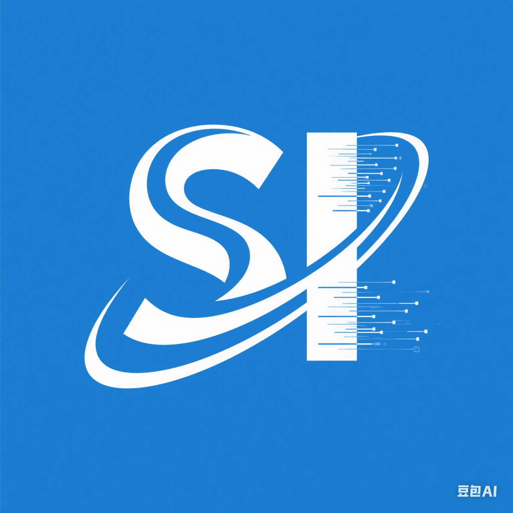
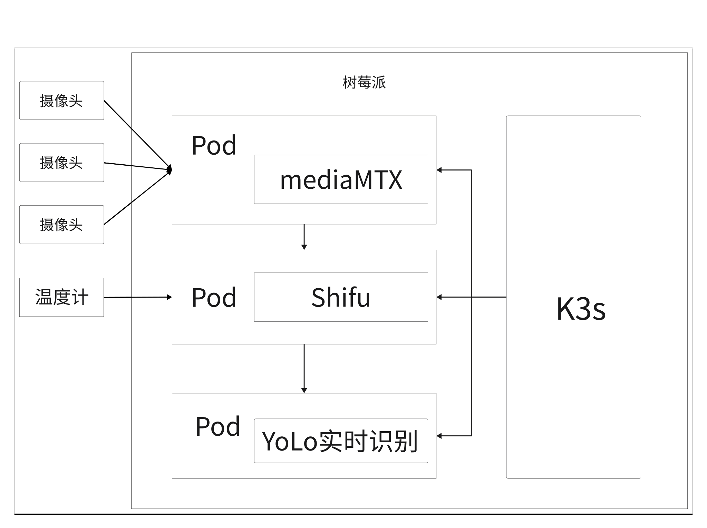
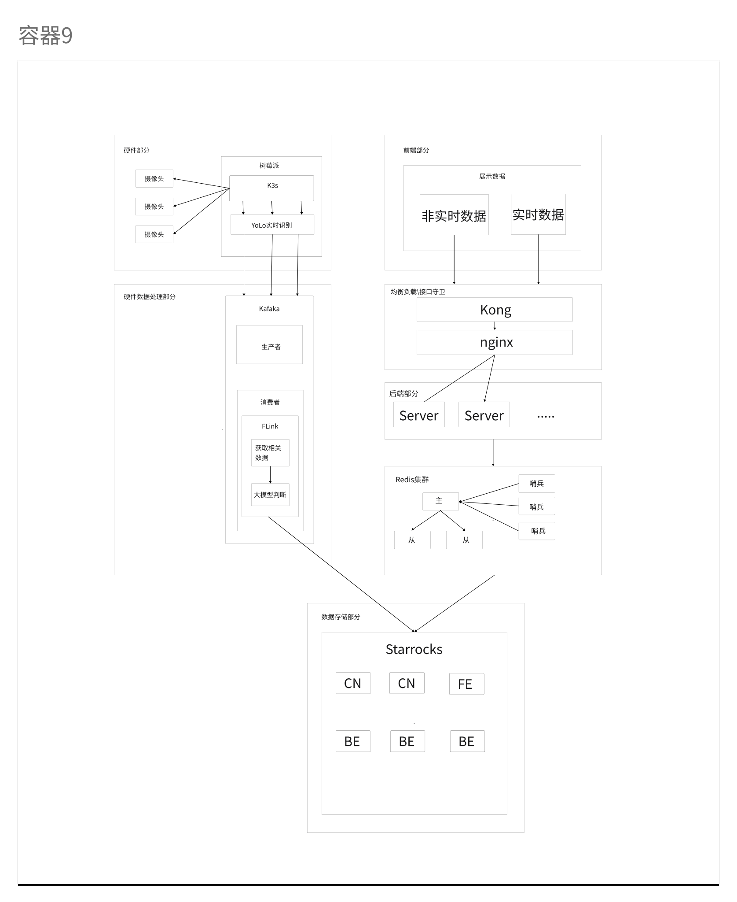

中文 | [英文](README-en.md)

## SightIQ 介绍

</img>

 

<h1 style="border-bottom: none">
 
    快速实时数据处理及可视一体化
 
</h1>

# 硬件部分

- 摄像头部分(k3s) shifu/树莓派

# 数据处理部分
- kafaka/flink/大模型分析(k8s) python

# 数据存储部分
- startrocks(k8s) SQL

# 服务端
- server/Redis(k8s) Rust

# 服务端安全
- nginx/kong(k8s) shell

# 客户端
- 前端部分(k8s) Vite+vue

整体架构

