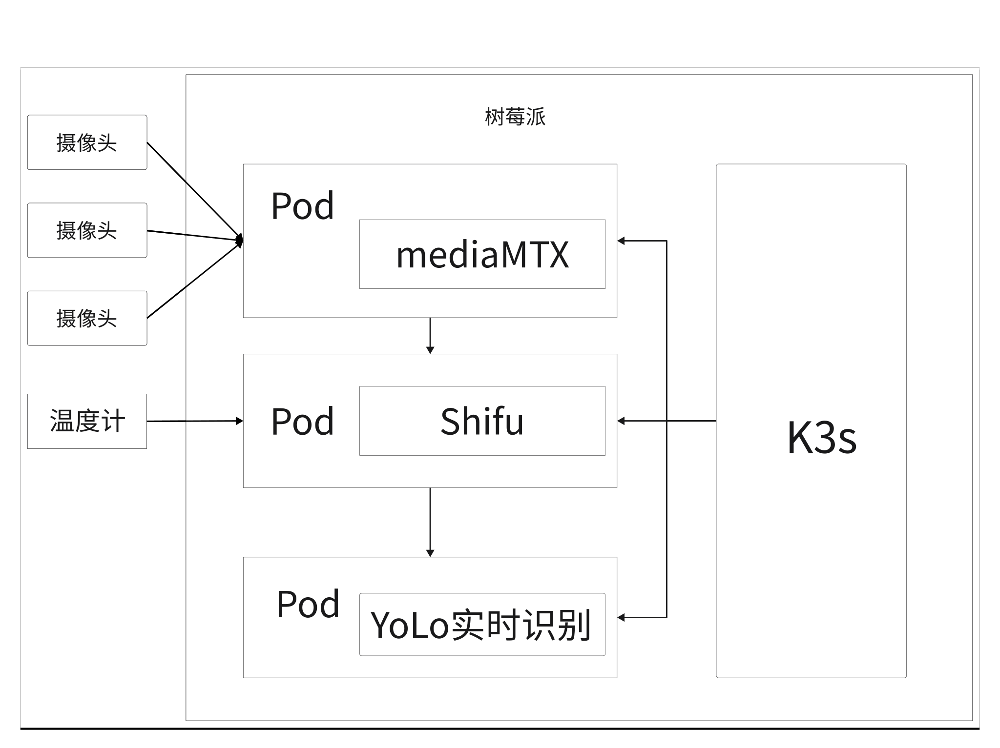
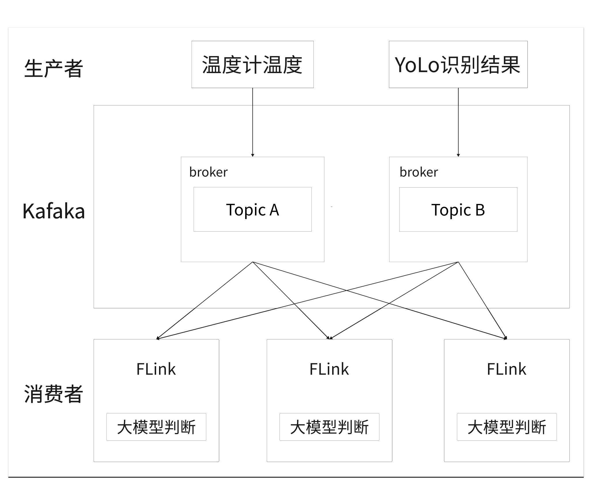
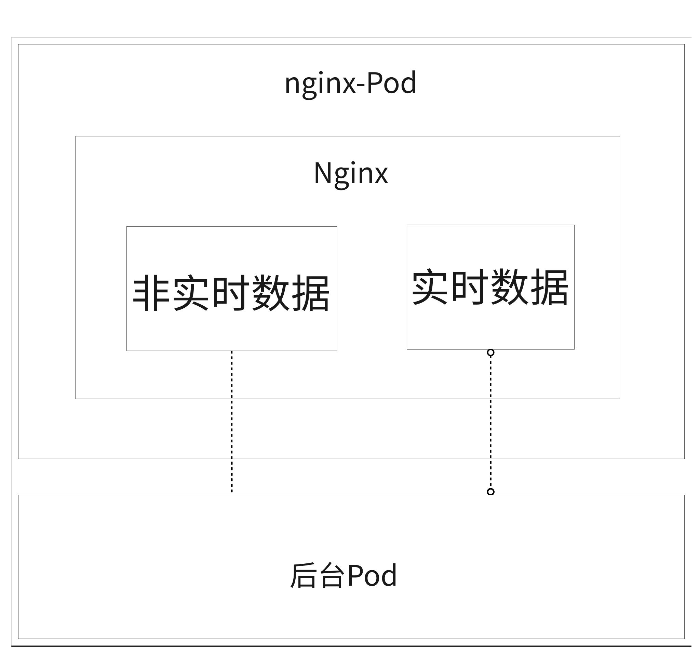
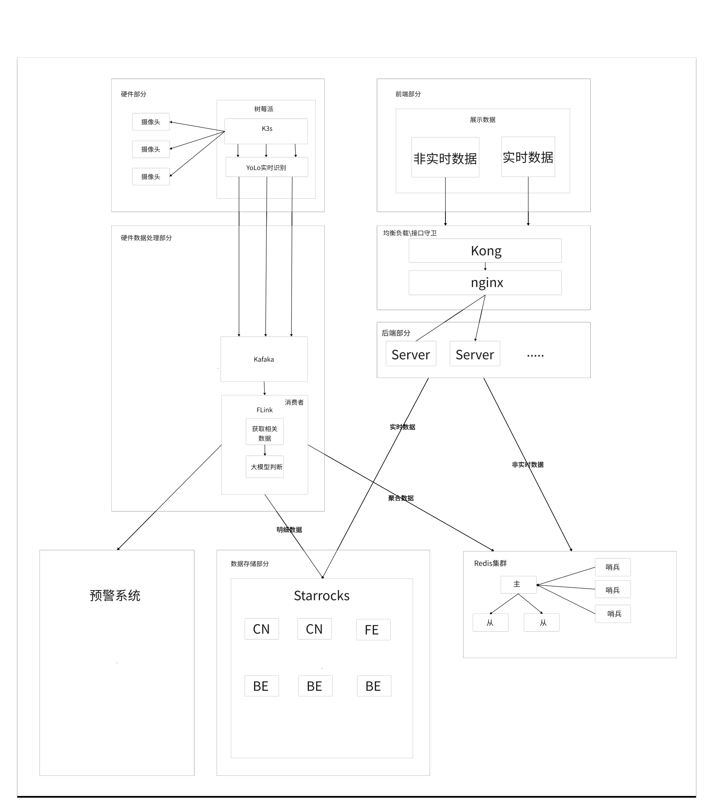

<div align="right">

中文 | [英文](README-en.md)

[](https://gitee.com/wdep/sightiq/stargazers)
[](https://gitee.com/wdep/sightiq/members)

<div align="center">
</img>
</div>
</div>
 
<div align="center">

<h1 style="border-bottom: none">
<br>
    快速实时数据处理及可视一体化
<br />
</h1>
</div>
<hr/>

# 项目介绍
本项目旨在于解决大数据实时处理及可视化问题，通过硬件部分摄像头数据收集使用Flink、Kafaka对数据流实时处理降低延时性，然后通过starrocks实时数仓对数据进行存储以及处理，最后将数据通过服务端传输到客户端进行可视化，而starrocks则会将数据进行持久化存储或进行二次数据分析。
# 项目优势
- 所有都使用k8s进行部署，各个组件之间解耦，可供用户选择性部署或进行二次开发。
- 通过Flink对数据进行实时处理，并交给大模型Agent进行分析，最后将分析结果传输到Redis，作为数据展示的一部分缓存。
- 通过starrocks对数据进行持久化存储，并进行二次数据分析。
- 通过服务端传输到客户端进行可视化，而starrocks则会将数据进行持久化存储或进行二次数据分析。


# 硬件部分
这一部分旨在通过摄像头收集数据，并进行实时处理，作为Kafaka的数据源(生产者)将数据传输到Kafka中。
- 摄像头部分(k3s) shifu/树莓派



# 数据处理部分
这一部分旨在通过Flink(消费者)对Kafka中的数据进行实时处理，并交给大模型Agent进行分析，最后将分析结果传输到Redis，作为数据展示的一部分缓存。


# 数据存储部分
这一部分旨在通过starrocks对数据进行数据分析及持久化存储，同时作为数据分析的中间件，为服务端提供数据查询服务。同样开发者们也可以将starrocks作为中间件可以将数据通过starrocks存储到数据湖中或进行二次数据分析。
# 服务端
这一部分旨在通过Rust语言开发一个服务端，使用redis作为与starrocks中的数据缓存中间件，使用nginx部署实现负载均衡，为客户端提供数据查询、以及数据分析处理服务。
# 客户端
这一部分旨在通过Vite+vue开发一个客户端，为客户端提供数据展示、以及数据分析处理服务。


# 项目整体结构


# 快速上手
```
git clone --recurse-submodules https://gitee.com/wdep/sightiq.git

cd sightiq/scripts

bash start.sh
```